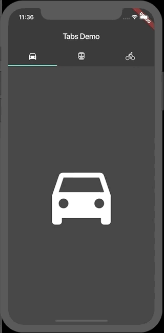

# En este proyecto vas a encontrar diferentes Branch con varios ejemplos, puedes navegar en cada uno y ver los ejercicios realizados.

# Working with Tabs

Trabajar con tabs es un patron común en las aplicaciones, Flutter incluye una forma conveniente de crear Tabs.

