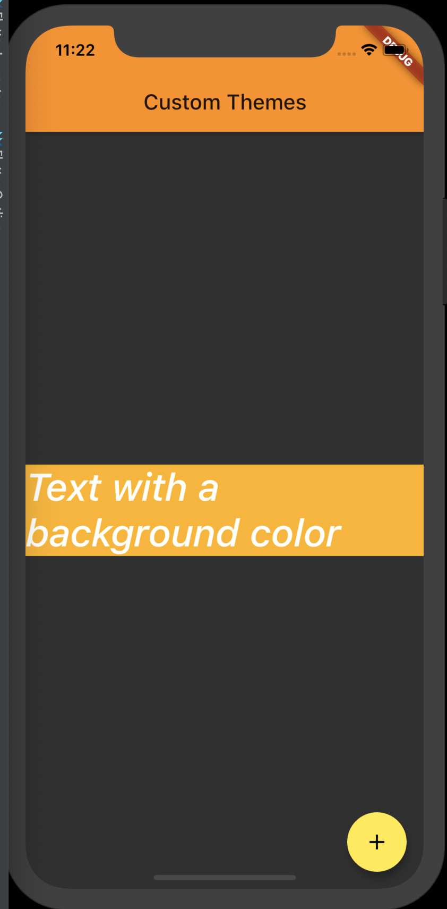

# En este proyecto vas a encontrar diferentes Branch con varios ejemplos, puedes navegar en cada uno y ver los ejercicios realizados.

# Usar Themes para compartir colores y estilos de fuentes.

Para compartir diferentes tipos de fuentes en toda la app y colores, podemos usar los Themes.

