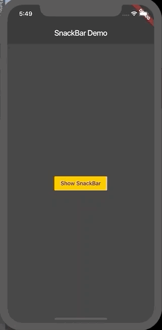

# Displaying Snackbars

En algunos casos es importante informar a nuestros usuarios cuando se ejecutan ciertas acciones, por ejemplo cuando un usuario elimina un elemento de la lista, debemos informarle por medio de un mensaje que algo se elimino, para esto usamos un SnackBar.

