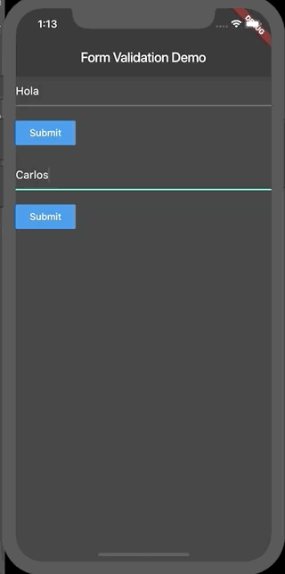

# En este proyecto vas a encontrar diferentes Branch con varios ejemplos, puedes navegar en cada uno y ver los ejercicios realizados.

# Building a form with Validation

Las aplicaciones a veces requieren que la información que se ingresa en un text field sea verificada. Para esto usamos una validación.

