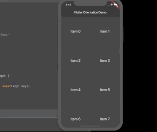

# Updating the UI based on Orientation.

En algunos casos es necesario diseñar aplicaciones que funcionen tanto en portrati como en Landscape, en este ejemplo vamos a ver como ubicar los elementos de un Grid de 2 columnas cuando esta en portrait a 3 columnas cuando esta en Landscape, para resolver esto utilizamos OrientationBuilder.

```dart
@override
  Widget build(BuildContext context) {
    return Scaffold(
      appBar: AppBar(title: Text(title)),
      body: OrientationBuilder(
        builder: (context, orientation) {
          return GridView.count(
          // Se usa un operador ternario para preguntar la orientación
          // si la orientación es igual a portrait crossAxisCount es igual a 2, 
          // si esta en Landscape es igual a 3.
            crossAxisCount: orientation == Orientation.portrait ? 2 : 3,
            children: List.generate(100, (index) {
              return Center(
                child: Text(
                  'Item $index',
                  style: Theme.of(context).textTheme.headline,
                ),
              );
            }),
          );
        },
      ),
    );
  }
  ```


